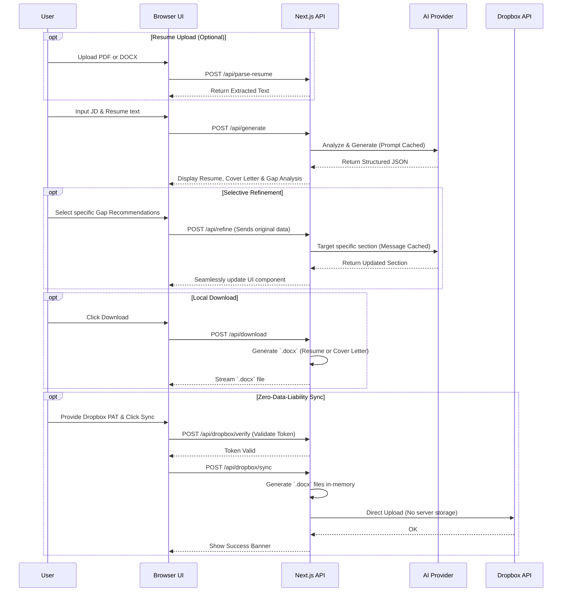

# 🧠 Resume Builder — AI-Powered ATS Resume Optimizer

Transform your resume to match any job description using Claude, GPT-4o, or a local Ollama model.  
One click generates a tailored resume, gap analysis, cover letter — all downloadable as `.docx`.

---

## ✨ Features

| Feature | Description |
|---------|-------------|
| **ATS-Optimized Resume** | 5-step methodology: JD analysis → keyword gap → section rewrites → formatting → summary |
| **Keyword Coverage Score** | 0–100% match with colour-coded indicator and honest disclaimer |
| **Gap Analysis** | Strong matches, implied gaps, dealbreakers, actionable recommendations |
| **Missing Keywords Panel** | AI surfaces keywords you may have but didn't include — you select which apply |
| **Selective Refine** | Apply only the recommendations you choose — always from the original, never chained |
| **Revert to Original** | Instantly restore the pre-refine state — zero tokens, zero API calls |
| **Original / Updated Toggle** | Side-by-side comparison of before/after in Resume and Cover Letter cards |
| **Cover Letter** | 3–4 paragraph letter tailored to the JD and company |
| **`.docx` Download** | ATS-clean Word files; Download respects the active Original/Updated view |
| **Multi-Provider LLM** | Anthropic → OpenAI → Ollama with auto-fallback and banner notification |
| **Cost & Latency Optimized** | Native Prompt Caching (Anthropic) and automatic message caching (OpenAI) for efficient token usage and multi-turn refinement |
| **Dropbox Sync** | Zero-Data-Liability integration to securely save generated `.docx` files directly to your Dropbox |
| **Your key, your data** | API keys in `sessionStorage` only — never logged or persisted server-side |
| **Rate Limiting** | 5 generates / min · 15 refines / min per IP — friendly 429 countdown message |

---

## 🚀 Quick Start

```bash
# 1. Clone
git clone https://github.com/hardikshukla/resume-builder
cd resume-builder

# 2. Install
npm install

# 3. Configure
cp .env.example .env.local
# No API keys needed in .env.local — users paste their own key in the UI

# 4. Run
npm run dev
# → http://localhost:3000
```

---

## ⚙️ Environment Variables

Copy `.env.example` → `.env.local`. All values are optional with sensible defaults.

| Variable | Default | Description |
|----------|---------|-------------|
| `DEFAULT_LLM_PROVIDER` | `anthropic` | Provider to show by default in the UI |
| `ANTHROPIC_MODEL` | `claude-haiku-4-5` | Claude model ID (user can override in UI) |
| `OPENAI_MODEL` | `gpt-4o` | OpenAI model ID (user can override in UI) |
| `OLLAMA_BASE_URL` | `http://localhost:11434` | Ollama server base URL |
| `OLLAMA_MODEL` | `llama3` | Ollama model name |
| `ALLOW_LOCALHOST_OLLAMA` | _(unset)_ | Set to `1` to allow users to target `localhost` as an Ollama URL. Unset by default (SSRF guard blocks it). |
| `NEXT_PUBLIC_SENTRY_DSN` | _(unset)_ | Sentry DSN for browser error tracking. Sentry is a no-op if unset. |
| `SENTRY_DSN` | _(unset)_ | Sentry DSN for server-side error tracking (falls back to `NEXT_PUBLIC_SENTRY_DSN`) |
| `SENTRY_ORG` | _(unset)_ | Sentry org slug — only needed for source map upload in CI |
| `SENTRY_PROJECT` | _(unset)_ | Sentry project name — only needed for source map upload in CI |

> **API keys are NOT in `.env`** — users paste their own key in the UI. Keys are held in `sessionStorage` and sent per-request over HTTPS. They are never logged, stored, or returned by the server.

---

## 📡 API Routes

| Route | Method | Purpose |
|-------|--------|---------|
| `/api/generate` | `POST` | Full resume generation — runs the 5-step ATS methodology |
| `/api/refine` | `POST` | Surgical update — applies selected recommendations to the original resume |
| `/api/download` | `POST` | Streams a `.docx` blob for resume or cover letter |
| `/api/parse-resume` | `POST` | Extracts plain text from an uploaded PDF or DOCX |
| `/api/models` | `POST` | Lists available models for the selected provider (cached 60s per user) |
| `/api/dropbox/verify` | `POST` | Validates the user's Dropbox personal access token |
| `/api/dropbox/sync` | `POST` | Uploads the generated `.docx` files directly to the user's Dropbox |

### Rate Limits (middleware.ts)

| Route | Limit | Window |
|-------|-------|--------|
| `/api/generate` | 5 requests | 60 seconds per IP |
| `/api/refine` | 15 requests | 60 seconds per IP |

Returns `429` with `Retry-After` header and a `retryAfterSeconds` field in the JSON body.

---

## 🔄 System Workflows

### Core Generation & Refinement Flow


### LLM Fallback Chain
```mermaid
graph TD
    Start([Generate Request]) --> Router{Primary Provider}
    Router -->|Anthropic| Claude[Claude (e.g. Haiku)]
    Router -->|OpenAI| GPT[OpenAI (e.g. GPT-4o)]
    Router -->|Ollama| Local[Local Ollama]

    Claude -- API Error/Rate Limit --> GPT
    GPT -- API Error/Rate Limit --> Local
    Local -- Error --> Err([Throw Detailed Error])

    Claude -- Success --> Done([Return Data])
    GPT -- Success --> Done
    Local -- Success --> Done
```
*A banner automatically appears in the UI whenever a fallback provider was used.*

---

## 📁 Project Structure

```
hooks/
  useProviderConfig.ts    ← Provider/API-key state + sessionStorage persistence + lock flag
  useGenerate.ts          ← Generation inputs, output, originalOutput, handleGenerate
  useRefine.ts            ← Refine state, handleRefine (always-from-original), handleRevert

app/
  page.tsx                ← 120-line orchestrator — composes the three hooks + layout
  globals.css             ← Design tokens, component styles (pure CSS, no Tailwind)
  layout.tsx              ← Root layout + SEO metadata
  api/
    generate/route.ts     ← Full generation endpoint
    refine/route.ts       ← Selective improvement endpoint
    download/route.ts     ← DOCX streaming with sanitized filename
    parse-resume/route.ts ← PDF/DOCX text extraction
    models/route.ts       ← Provider model list (SSRF-validated for Ollama)
    dropbox/verify/route.ts ← Token validation for Dropbox integration
    dropbox/sync/route.ts ← Secure DOCX upload to Dropbox

components/
  ResumeForm.tsx          ← Left panel: inputs, provider selector (lockable), generate button
  OutputPanel.tsx         ← Right panel: keyword coverage, gap analysis, refine controls,
                            Original/Updated toggle, revert banner, missing keywords panel
  ProviderSelector.tsx    ← Provider + API key + model override inputs
  DownloadButton.tsx      ← Triggers /api/download for resume or cover letter
  ResumeUploader.tsx      ← Drag-and-drop resume file upload → text extraction

lib/
  env.ts                  ← Startup env-var validation (fail-fast on missing required vars)
  prompt.ts               ← buildSystemPrompt() + buildUserMessage() + buildRefinePrompt()
  docxGenerator.ts        ← ATS-clean resume DOCX (Times New Roman, adaptive sections)
  coverLetterGenerator.ts ← Cover letter DOCX (matching header, dedup salutation)
  constants.ts            ← MAX_RESUME_CHARS, MAX_JD_CHARS, warn thresholds
  llm/
    index.ts              ← Fallback-chain router
    anthropic.ts          ← Claude handler (with native prompt caching)
    openai.ts             ← GPT-4o handler (with automatic message caching)
    ollama.ts             ← Ollama handler
    dispatch.ts           ← Raw dispatch for refine route
    guard.ts              ← Output schema validator

middleware.ts             ← Rate limiting (sliding window per IP, 429 + Retry-After)
types/index.ts            ← All shared TypeScript types

__tests__/
  prompt.test.ts          ← Unit tests: buildSystemPrompt, buildRefinePrompt, GapAnalysis
  docx.test.ts            ← Structural tests: DOCX generators (PK magic, size, diff)

sentry.client.config.ts   ← Browser error tracking (API key scrubbing, replay masking)
sentry.server.config.ts   ← Server error tracking (API key scrubbing from request bodies)
sentry.edge.config.ts     ← Edge/middleware error tracking
```

---

## 🔒 Security Model

```
User pastes API key in UI
  → sessionStorage (cleared on tab close)
  → Sent in HTTPS request body only
  → Used to call LLM provider
  → NEVER logged, stored, or returned
  → Redacted from Sentry events by beforeSend()
```

Additional hardening:
- **SSRF protection** — `/api/models` validates `ollamaUrl` against a blocklist of internal IP ranges
- **Rate limiting** — sliding-window per-IP counter in middleware
- **Filename sanitization** — `Content-Disposition` strips path traversal chars and uses RFC 5987 encoding
- **Security headers** — CSP, `X-Frame-Options: DENY`, HSTS, `Permissions-Policy`, `Referrer-Policy`

---

## 🧪 Tests

```bash
npm test                  # Run all tests
npm run test:coverage     # With coverage report
```

| Suite | What it tests |
|-------|--------------|
| `prompt.test.ts` | `buildSystemPrompt` idempotency, placeholder rule, 5-step headings, `buildRefinePrompt` embedding, GapAnalysis schema shape |
| `docx.test.ts` | DOCX generators return valid ZIP blobs (PK magic), produce >5 KB files, and produce different output for different inputs |

---

## 🚀 Deploy to Vercel

```bash
npx vercel
```

Set these in Vercel Dashboard → Project → Settings → Environment Variables:

```
DEFAULT_LLM_PROVIDER=anthropic
ANTHROPIC_MODEL=claude-haiku-4-5
OPENAI_MODEL=gpt-4o
OLLAMA_BASE_URL=http://localhost:11434
OLLAMA_MODEL=llama3
NEXT_PUBLIC_SENTRY_DSN=https://...    # optional
SENTRY_DSN=https://...                # optional
SENTRY_ORG=your-org                   # optional, for CI source maps
SENTRY_PROJECT=resume-builder         # optional, for CI source maps
```

No API keys go into Vercel — users bring their own.

---

## 📦 Tech Stack

| Layer | Choice |
|-------|--------|
| Framework | Next.js 14 (App Router) |
| Language | TypeScript |
| Styling | Vanilla CSS (no Tailwind) |
| LLM Primary | Anthropic Claude |
| LLM Fallback 1 | OpenAI GPT-4o |
| LLM Fallback 2 | Ollama (local) |
| DOCX | `docx` npm package |
| Error Tracking | Sentry (optional) |
| Icons | Lucide React |
| Tests | Jest + ts-jest |
| Hosting | Vercel |
