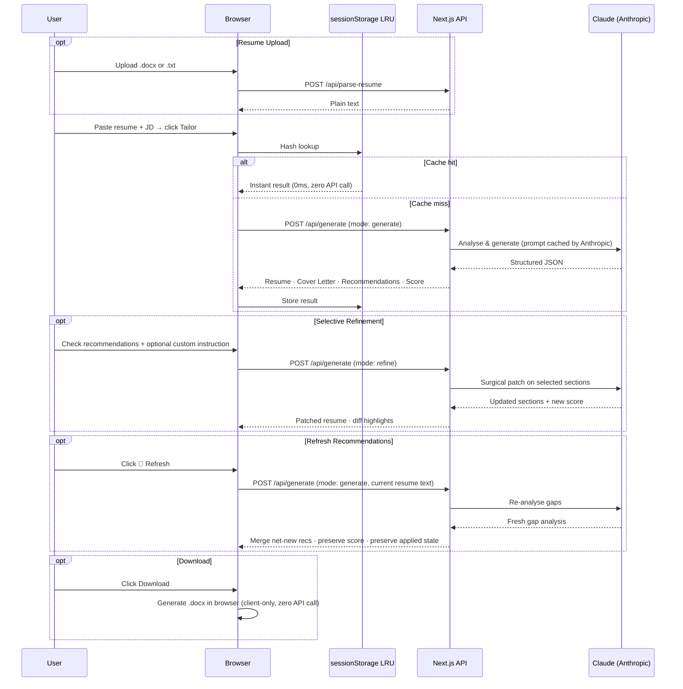

# Resume Builder — AI-Powered ATS Resume Optimizer

Transform your resume to match any job description in one click. Powered by Claude (Anthropic). Generates a tailored resume, structured gap analysis, and cover letter — all downloadable as `.docx` directly in the browser.

**Live demo:** [resume-builder-phi-wine.vercel.app](https://resume-builder-phi-wine.vercel.app)

---

## How It Works (User Perspective)

### 1 · Generate
Paste your resume and a job description, then click **Tailor Resume**. The AI runs a full ATS analysis and returns:
- A rewritten resume with keywords from the JD woven in naturally
- A tailored 3–4 paragraph cover letter
- An **ATS Match Score** (0–100%)
- Structured **Recommendations** — each with a claim, target section, risk level, and evidence detail
- A **Dealbreakers** list — hard JD requirements your resume currently doesn't cover

### 2 · Review Recommendations
Each recommendation is a structured card showing:
- **Claim** — what to add or strengthen
- **Target Section** — which resume section to update
- **Risk Badge** — `LOW` (safe addition) · `MEDIUM` · `HIGH` (bold claim, needs solid evidence)
- **Evidence** — what the JD requires vs. what was found in your resume

### 3 · Refine (Surgically)
Check the recommendations you want to apply. You can also type **custom instructions** (e.g. *"Mention my Docker project under Acme Corp"*). Click **Apply Selected** — the AI surgically patches only those sections without touching the rest of your resume.

### 4 · Refresh Recommendations
After refining, click the **🔄 Refresh** button at the top of the Recommendations panel. The system re-analyses your updated resume and surfaces any new gaps — without ever repeating recommendations you've already addressed or resetting your applied state.

### 5 · Compare & Download
Toggle **Show Highlights** to see a word-level diff of every change:
- 🟢 Green — added text
- 🔴 Red — removed text

Download your final resume and cover letter as `.docx` or export as PDF via **Print**.

---

## Features

| Feature | Detail |
|---------|--------|
| **ATS-Optimised Resume** | 6-step methodology: analyse JD → keyword gap → section rewrites → formatting → populate → cover letter |
| **ATS Match Score** | 0–100% with colour-coded progress bar |
| **Structured Recommendations** | Rich records: `{ claim, targetSection, evidenceRequired, evidenceFound, riskLevel }` |
| **Dealbreakers Panel** | Hard JD requirements flagged separately from general gaps |
| **Selective Refine** | Apply only the gaps you choose — surgical patches, never a full rewrite |
| **Custom Instructions** | Type any freeform instruction and apply it as a low-risk recommendation |
| **Refresh Recommendations** | Re-analyse current resume vs. JD; merges only net-new gaps, preserves applied state |
| **ATS Score Stability** | Score only updates on explicit refine — refresh never causes score regression |
| **Word-level Diff Highlights** | Green/red inline highlights show exactly what changed |
| **Revert to Original** | Instantly restore the pre-refine draft — zero API calls |
| **Cover Letter** | 3–4 paragraphs tailored to JD + company |
| **`.docx` Download** | ATS-clean Word files generated entirely in the browser |
| **Print / PDF Export** | Print-to-PDF from any browser |
| **DOCX Upload** | Upload your existing `.docx` or `.txt` resume for auto-parsing |
| **10-Entry LRU Cache** | Recent generations cached client-side; switching between JDs is instant |
| **Dropbox Sync** | Upload directly to Dropbox from the browser — token never touches the server |
| **Zero Data Liability** | API keys live in `sessionStorage` only — cleared on tab close, never logged |
| **Rate Limiting** | 15 requests / 60 s per IP with `Retry-After` header on `429` |

---

## Quick Start

```bash
# 1. Clone
git clone https://github.com/hardikshukla/resume-builder
cd resume-builder

# 2. Install
npm install

# 3. Configure (optional — see Environment Variables below)
cp .env.example .env.local

# 4. Run
npm run dev
# → http://localhost:3000
```

The app works without any `.env.local` configuration — users paste their own Anthropic API key in the UI.

---

## Environment Variables

| Variable | Default | Description |
|----------|---------|-------------|
| `ANTHROPIC_API_KEY` | *(unset)* | Server-side Anthropic key. If set, users don't need to provide their own key. |
| `ANTHROPIC_MODEL` | `claude-3-5-sonnet-20241022` | Default Claude model ID (user can override in UI) |
| `NEXT_PUBLIC_SENTRY_DSN` | *(unset)* | Sentry DSN for browser error tracking (optional) |
| `SENTRY_DSN` | *(unset)* | Sentry DSN for server-side tracking (optional) |
| `SENTRY_ORG` | *(unset)* | Sentry org slug — only needed for CI source-map upload |
| `SENTRY_PROJECT` | *(unset)* | Sentry project name — only needed for CI source-map upload |

> **API keys never go in `.env` permanently.** If `ANTHROPIC_API_KEY` is not set, users bring their own key via the UI. Keys travel only in HTTPS request bodies and are never logged, stored, or returned by the server.

---

## API Routes

| Route | Method | Purpose |
|-------|--------|---------|
| `POST /api/generate` | POST | Full generation (`mode: 'generate'`) and surgical refinement (`mode: 'refine'`) in one unified route |
| `POST /api/parse-resume` | POST | Extracts plain text from an uploaded `.docx` or `.txt` file (via `mammoth`) |
| `POST /api/models` | POST | Lists available Claude models for the provided API key |
| `GET /api/config` | GET | Returns server configuration (e.g. whether a server-side API key is configured) |
| `POST /api/dropbox/verify` | POST | Validates a Dropbox personal access token |

### `POST /api/generate` — Request Body

```ts
// mode: 'generate'
{
  mode: 'generate';
  resume: string;           // candidate resume text
  jobDescription: string;   // target JD text
  companyName?: string;     // optional, used in cover letter
  anthropicKey?: string;    // user-supplied key (overrides server key)
  model?: string;           // Claude model override
}

// mode: 'refine'
{
  mode: 'refine';
  resume: string;
  jobDescription: string;
  companyName?: string;
  anthropicKey?: string;
  model?: string;
  currentOutput: {
    resume: ResumeData;
    coverLetter?: CoverLetterData;
  };
  selectedRecommendations: Recommendation[];   // structured records
}
```

### Rate Limits

| Route | Limit | Window |
|-------|-------|--------|
| `/api/generate` | 15 requests | 60 s per IP |
| `/api/dropbox/verify` | 20 requests | 60 s per IP |

Returns `429` with a `Retry-After` header and `retryAfterSeconds` in the JSON body.

---

## Client-Side Caching

The app maintains a **10-entry LRU cache** in `sessionStorage` keyed by a SHA-256 hash of `{ resume, jobDescription, companyName, model }`.

| Behaviour | Detail |
|-----------|--------|
| **Instant cache hits** | Hash is checked *before* any loading states are updated — zero visual flash |
| **Multi-JD switching** | Up to 10 different runs are remembered per session |
| **LRU eviction** | The oldest entry is removed when the 11th unique run is added |
| **Session-scoped** | Cleared on tab close, page reload, or after 20 min of inactivity |
| **No score regression** | Refresh calls never overwrite the post-refine ATS score |

---

## Sequence Diagram



---

## Project Structure

```
resume-builder/
├── app/
│   ├── page.tsx                    # Single-page UI orchestrator
│   ├── layout.tsx                  # Root layout + SEO metadata
│   ├── globals.css                 # Design tokens and component styles
│   ├── global-error.tsx            # Sentry global error boundary
│   └── api/
│       ├── generate/route.ts       # Unified generate + refine LLM endpoint
│       ├── parse-resume/route.ts   # DOCX/TXT text extraction (mammoth)
│       ├── models/route.ts         # List available Claude models
│       ├── config/route.ts         # Server configuration endpoint
│       └── dropbox/
│           └── verify/route.ts     # Validate Dropbox PAT
│
├── hooks/
│   ├── useGenerate.ts              # Core orchestration hook: generate, refine, refresh, revert
│   ├── useApiKey.ts                # API key + Dropbox token state (sessionStorage)
│   └── useInactivityTimeout.ts    # Auto-clears sessionStorage after 20 min
│
├── lib/
│   ├── prompt.ts                   # buildSystemPrompt(), buildUserMessage(), buildRefinePrompt()
│   ├── docxGenerator.ts            # Resume .docx generator (browser-side)
│   ├── coverLetterGenerator.ts     # Cover letter .docx generator (browser-side)
│   ├── constants.ts                # MAX_RESUME_CHARS, MAX_JD_CHARS, warning thresholds
│   ├── env.ts                      # Runtime environment helpers
│   ├── llm/
│   │   ├── index.ts                # LLM router (Anthropic)
│   │   ├── anthropic.ts            # Claude API handler with native prompt caching
│   │   └── schema.ts               # Zod schema for LLM output validation
│   └── utils/
│       └── string.ts               # buildDownloadFilename, capitalizeName, resumeDataToText
│
├── components/
│   └── ThemeRegistry.tsx           # MUI theme + Emotion cache registry
│
├── types/
│   └── index.ts                    # All shared TypeScript interfaces and types
│
├── middleware.ts                   # Sliding-window rate limiting per IP
│
└── __tests__/
    ├── prompt.test.ts              # System prompt rules, refine prompt structure, schema shape
    ├── docx.test.ts                # DOCX generators produce valid ZIP blobs > 5 KB
    ├── filename.test.ts            # Download filename sanitisation
    ├── timeout.test.ts             # Inactivity timeout logic
    ├── sentry.test.ts              # Sentry config validation
    └── generateValidation.test.ts  # API request validation edge cases
```

---

## Key Types

```ts
// Structured recommendation (returned by LLM, rendered as cards in UI)
interface Recommendation {
  id: string;
  claim: string;              // what to add or strengthen
  targetSection: string;      // which resume section
  evidenceRequired: string;   // what the JD demands
  evidenceFound: string;      // what was found in the resume
  riskLevel: 'low' | 'medium' | 'high';
  resolvesDealbreakers: string[];
}

// Full output from /api/generate (mode: generate)
interface ResumeBuilderOutput {
  resume: ResumeData;
  coverLetter?: CoverLetterData;
  gapAnalysis: GapAnalysis;
}

interface GapAnalysis {
  matchScore: number;           // 0–100
  strongMatches: string[];
  keywordsAdded: string[];
  dealbreakers: Dealbreaker[];
  recommendations: Recommendation[];
  extractedCompanyName?: string;
}
```

---

## Security

```
User pastes API key in UI
        │
        ▼
sessionStorage (tab-scoped, cleared on close / inactivity)
        │
        ▼
HTTPS request body only  ──►  Next.js API Route  ──►  Anthropic
                                      │
                                      ▼
                          Never logged · never stored
                          never returned · scrubbed from Sentry
```

Additional hardening:

| Control | Detail |
|---------|--------|
| **Rate limiting** | Sliding-window per-IP counter in `middleware.ts` |
| **Input length caps** | `MAX_RESUME_CHARS` and `MAX_JD_CHARS` enforced before LLM call |
| **Zod validation** | All LLM responses validated against schema before reaching the UI |
| **Security headers** | CSP, `X-Frame-Options: DENY`, HSTS, `Permissions-Policy`, `Referrer-Policy` |
| **Prompt injection guard** | Resume and JD content wrapped in `<security_boundary>` XML tags in the prompt |
| **sessionStorage hygiene** | Cleared on tab close (`beforeunload`) and after 20 min of inactivity |

---

## Tests

```bash
npm test               # Run all tests
npm run test:coverage  # With coverage report
```

| Suite | Coverage |
|-------|----------|
| `prompt.test.ts` | System prompt rules (placeholder, 15-word project limit, security boundary), refine prompt embedding, GapAnalysis schema shape |
| `docx.test.ts` | DOCX generators return valid ZIP blobs (PK magic bytes), files > 5 KB, distinct output for distinct inputs |
| `filename.test.ts` | Download filename sanitisation and formatting |
| `timeout.test.ts` | Inactivity session lock logic |
| `sentry.test.ts` | Sentry configuration validation |
| `generateValidation.test.ts` | API request body validation edge cases |

---

## Deploy to Vercel

```bash
npx vercel
```

Set these in **Vercel Dashboard → Project → Settings → Environment Variables** (all optional):

```env
ANTHROPIC_API_KEY=sk-ant-...        # Optional: users can bring their own key in the UI
NEXT_PUBLIC_SENTRY_DSN=https://...  # Optional: error tracking
SENTRY_DSN=https://...              # Optional: server-side error tracking
SENTRY_ORG=your-org                 # Optional: CI source map upload only
SENTRY_PROJECT=resume-builder       # Optional: CI source map upload only
```

No API keys are required in Vercel — users bring their own via the UI.

---

## Tech Stack

| Layer | Choice |
|-------|--------|
| Framework | Next.js 14 (App Router) |
| Language | TypeScript |
| UI Components | Material UI v9 |
| Styling | Vanilla CSS (no Tailwind) |
| LLM Provider | Anthropic Claude (with native prompt caching) |
| Output Validation | Zod |
| DOCX Generation | `docx` npm package (browser-side) |
| DOCX Parsing | `mammoth` |
| Error Tracking | Sentry (optional) |
| Tests | Jest + ts-jest |
| Hosting | Vercel |
