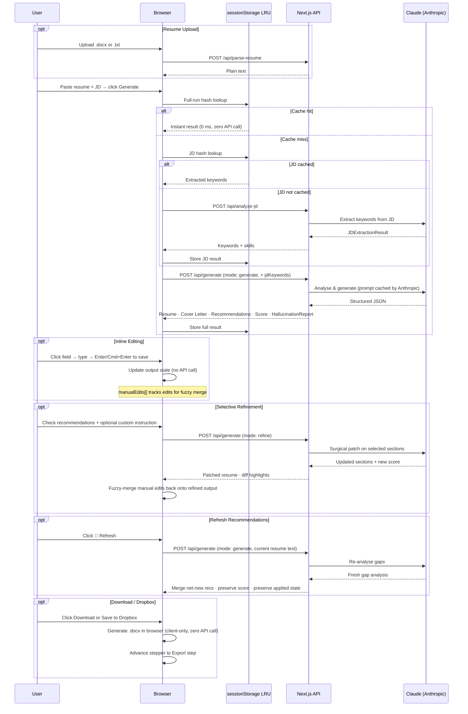

# Resume Builder — AI-Powered ATS Resume Optimizer

Transform your resume to match any job description in minutes. Powered by Claude (Anthropic). Produces a tailored resume, gap analysis, and cover letter — all downloadable as `.docx` files, with zero data stored server-side.

**Live demo:** [resume-builder-phi-wine.vercel.app](https://resume-builder-phi-wine.vercel.app)

---

## How It Works

### Step 1 · Input Parameters
Paste your current resume (or upload a `.docx`/`.txt` file), paste the target job description, and optionally enter the company name. Set your Anthropic API key once — it lives in `sessionStorage` and is never stored anywhere else.

### Step 2 · Analyze & Generate
Click **✨ Generate Tailored Resume**. The AI runs in two stages:

1. **JD Extraction** — `/api/analyze-jd` pulls out must-have skills, nice-to-have skills, and gap signals from the JD (cached in `sessionStorage` by JD hash).
2. **Resume Generation** — `/api/generate` uses the extracted keywords to rewrite your resume and produce:
   - A rewritten resume with JD keywords woven in naturally
   - A tailored 3–4 paragraph cover letter
   - An **ATS Match Score** (0–100%)
   - Structured **Recommendations** with claim, risk level, and evidence
   - A **Dealbreakers** list of hard requirements your resume currently misses
   - An optional **Hallucination Report** flagging any AI-introduced claims that can't be verified against your original resume

### Step 3 · Review & Edit

**Gap Analysis tab** — Each recommendation renders as a card with:
- **Claim** — what to add or strengthen
- **Target Section** — which resume section to update
- **Risk Badge** — `LOW` · `MEDIUM` · `HIGH`
- **Evidence** — what the JD requires vs. what was found

**Click to edit inline** — Click any text field in the resume or cover letter preview to edit it directly. No separate edit screen. Changes are tracked automatically:
- Edited fields highlight with a blue left border
- Press `Enter` (single-line) or `Cmd/Ctrl+Enter` (multiline) to save
- Press `Escape` to cancel without saving

**Refine surgically** — Select recommendations (plus optional custom instructions) and click **Apply Selected**. The AI patches only the chosen sections.

**Refresh Recommendations** — Re-analyzes your current resume against the JD and surfaces new gaps without repeating recommendations you've already addressed or resetting your applied state.

**Fuzzy Merge on Refine** — When you refine after making inline edits, the app automatically re-applies your manual edits to the refined output using Levenshtein distance matching (tolerance ≤ 3 characters). Edits that can't be merged are surfaced as **Unapplied Edit** warnings on the relevant tab.

### Step 4 · Export
Toggle **Show Highlights** to see word-level diffs (🟢 added · 🔴 removed). Download `.docx` files or save directly to Dropbox. Downloading or saving automatically advances the workflow to the Export step.

---

## Features

| Feature | Detail |
|---------|--------|
| **4-Step Guided Workflow** | Horizontal stepper (`Input → Analyze & Generate → Review & Edit → Export`) with step locking and loading pulse animation |
| **Two-Stage Generation** | JD extraction (cached per JD hash) runs first, then resume generation receives pre-extracted keywords |
| **ATS-Optimised Resume** | 6-step methodology: analyse JD → keyword gap → section rewrites → formatting → populate → cover letter |
| **ATS Match Score** | 0–100% with colour-coded context chip |
| **Hallucination Guard** | Post-generation check flags any AI-introduced claims that aren't supported by the original resume |
| **Structured Recommendations** | `{ claim, targetSection, evidenceRequired, evidenceFound, riskLevel, resolvesDealbreakers }` |
| **Dealbreakers Panel** | Hard JD requirements flagged separately from general gaps |
| **Selective Refine** | Apply only the gaps you choose — surgical patches, never a full rewrite |
| **Custom Instructions** | Type any freeform instruction and apply it as a low-risk recommendation |
| **Refresh Recommendations** | Re-analyse current resume vs. JD; merges only net-new gaps, preserves applied state |
| **Inline Editing** | Click any text field in the resume or cover letter preview to edit it in-place |
| **Fuzzy Merge** | Manual edits are automatically re-applied after refinement (Levenshtein ≤ 3); unresolvable edits surface as tab-specific warnings |
| **Revert to Original** | Instantly restore the pre-refine draft — zero API calls |
| **Word-level Diff Highlights** | Green/red inline highlights show exactly what changed vs. the original |
| **Context Pill Chip Bar** | Shows active model, ATS score, edit count, and applied recommendation count |
| **Mobile Drawer Layout** | On small screens, parameters panel collapses into a slide-in drawer opened by a floating ⚙️ FAB |
| **DOCX Upload** | Upload your existing `.docx` or `.txt` resume for auto-parsing |
| **10-Entry LRU Cache** | Recent generations cached client-side in `sessionStorage`; switching between JDs is instant |
| **Blind-Posting Company Name** | When the JD is recruiter-anonymised (no company in body text), the app passes the user-entered company name as a `CANDIDATE IS APPLYING TO:` hint so Claude can still populate `companyName` correctly |
| **Cover Letter** | 3–4 paragraphs tailored to JD + company, editable inline |
| **`.docx` Download** | ATS-clean Word files generated entirely in the browser |
| **Print / PDF Export** | Print-to-PDF from any browser |
| **Dropbox Sync** | Upload directly to Dropbox — token never touches the server |
| **LLM Retry with Back-off** | Transient Anthropic errors (429, 5xx, network) retried up to 3× with exponential back-off |
| **Structured Error Banners** | API errors surface as dismissable banners with a **Retry** button; rate-limit errors include a live countdown timer. Retry correctly re-shows the button on repeated failures |
| **Rate Limiting** | 15 requests / 60 s per IP with `Retry-After` header on `429` |
| **Zero Data Liability** | API keys live in `sessionStorage` only — cleared on tab close and after 40 min of inactivity |

---

## Quick Start

```bash
# 1. Clone
git clone https://github.com/hardikshukla/resume-builder
cd resume-builder

# 2. Install
npm install

# 3. Configure (optional — see Environment Variables below)
cp .env.example .env.local

# 4. Run
npm run dev
# → http://localhost:3000
```

The app works without any `.env.local` configuration — users paste their own Anthropic API key in the UI.

---

## Environment Variables

| Variable | Default | Description |
|----------|---------|-------------|
| `ANTHROPIC_API_KEY` | *(unset)* | Server-side Anthropic key. If set, users don't need to provide their own. |
| `ANTHROPIC_MODEL` | `claude-3-5-sonnet-20241022` | Default Claude model ID (user can override in UI) |
| `NEXT_PUBLIC_SENTRY_DSN` | *(unset)* | Sentry DSN for browser error tracking (optional) |
| `SENTRY_DSN` | *(unset)* | Sentry DSN for server-side tracking (optional) |
| `SENTRY_ORG` | *(unset)* | Sentry org slug — only needed for CI source-map upload |
| `SENTRY_PROJECT` | *(unset)* | Sentry project name — only needed for CI source-map upload |

> **API keys never go in `.env` permanently.** If `ANTHROPIC_API_KEY` is not set, users bring their own key via the UI. Keys travel only in HTTPS request bodies and are never logged, stored, or returned by the server.

---

## API Routes

| Route | Method | Purpose |
|-------|--------|---------|
| `POST /api/analyze-jd` | POST | Extracts must-have skills, nice-to-haves, and gap signals from a job description |
| `POST /api/generate` | POST | Full generation (`mode: 'generate'`) and surgical refinement (`mode: 'refine'`) |
| `POST /api/parse-resume` | POST | Extracts plain text from an uploaded `.docx` or `.txt` file (via `mammoth`) |
| `POST /api/models` | POST | Lists available Claude models for the provided API key |
| `GET /api/config` | GET | Returns server configuration (e.g. whether a server-side API key is configured) |
| `POST /api/dropbox/verify` | POST | Validates a Dropbox personal access token |

### `POST /api/analyze-jd` — Request Body

```ts
{
  jobDescription: string;   // JD text (1–15,000 chars)
  companyName?: string;     // optional company name
  anthropicKey?: string;    // user-supplied key (overrides server key)
  model?: string;           // Claude model override
}
```

### `POST /api/generate` — Request Body

```ts
// mode: 'generate'
{
  mode: 'generate';
  resume: string;               // candidate resume text
  jobDescription: string;       // target JD text
  companyName?: string;
  anthropicKey?: string;
  model?: string;
  jdKeywords?: JDExtractionResult;  // pre-extracted from /api/analyze-jd
}

// mode: 'refine'
{
  mode: 'refine';
  resume: string;
  jobDescription: string;
  companyName?: string;
  anthropicKey?: string;
  model?: string;
  jdKeywords?: JDExtractionResult;
  currentOutput: {
    resume: ResumeData;
    coverLetter?: CoverLetterData;
  };
  selectedRecommendations: Recommendation[];
}
```

### Rate Limits

| Route | Limit | Window |
|-------|-------|--------|
| `/api/generate` | 15 requests | 60 s per IP |
| `/api/analyze-jd` | 15 requests | 60 s per IP |

Returns `429` with a `Retry-After` header and `retryAfterSeconds` in the JSON body.

---

## Client-Side Caching

The app maintains a **10-entry LRU cache** in `sessionStorage` keyed by a SHA-256 hash of `{ resume, jobDescription, companyName, model }`. JD analysis results are separately cached by JD hash.

| Behaviour | Detail |
|-----------|--------|
| **Instant cache hits** | Hash is checked *before* any loading states are set — zero visual flash |
| **Two-level cache** | JD extraction and full generation are cached independently |
| **Multi-JD switching** | Up to 10 different runs remembered per session |
| **LRU eviction** | Oldest entry removed when 11th unique run is added |
| **Session-scoped** | Cleared on tab close, page reload, or after 40 min of inactivity |

---

## Sequence Diagram



---

## Project Structure

```
resume-builder/
├── app/
│   ├── page.tsx                        # Single-page UI orchestrator (stepper, tabs, drawer)
│   ├── layout.tsx                      # Root layout + SEO metadata
│   ├── globals.css                     # Design tokens, EditableField styles, animations
│   ├── global-error.tsx                # Sentry global error boundary
│   └── api/
│       ├── generate/route.ts           # Unified generate + refine LLM endpoint
│       ├── analyze-jd/route.ts         # JD keyword extraction endpoint
│       ├── parse-resume/route.ts       # DOCX/TXT text extraction (mammoth)
│       ├── models/route.ts             # List available Claude models
│       ├── config/route.ts             # Server configuration endpoint
│       └── dropbox/
│           └── verify/route.ts         # Validate Dropbox PAT
│
├── components/
│   ├── WorkflowStepper.tsx             # 4-step guided stepper with lock and loading pulse
│   ├── ContextPill.tsx                 # Chip bar: model · ATS score · edit count · applied recs
│   ├── EditableField.tsx               # Click-to-edit wrapper with keyboard/a11y support
│   ├── GapAnalysisPanel.tsx            # Gap analysis, recommendations, refine controls
│   ├── ResumePreview.tsx               # A4 resume preview with inline editing + diff highlights
│   ├── CoverLetterPreview.tsx          # Cover letter preview with inline editing
│   ├── RecommendationCard.tsx          # Individual recommendation card component
│   ├── ErrorBanner.tsx                 # Dismissable error banner with rate-limit countdown
│   └── ThemeRegistry.tsx               # MUI theme + Emotion cache registry
│
├── hooks/
│   ├── useGenerate.ts                  # Core orchestration: generate, refine, refresh, revert,
│   │                                   #   manualEdits, orphanedEdits, fuzzy merge, isGenerationError
│   ├── useApiKey.ts                    # API key + Dropbox token state (sessionStorage)
│   └── useInactivityTimeout.ts         # Auto-clears sessionStorage after 40 min
│
├── lib/
│   ├── prompt.ts                       # SYSTEM_PROMPT, REFINE_SYSTEM_PROMPT, buildJDExtractionPrompt
│   ├── jdParser.ts                     # JD keyword extraction helpers
│   ├── docxGenerator.ts                # Resume .docx generator (browser-side, keyword bolding)
│   ├── coverLetterGenerator.ts         # Cover letter .docx generator (browser-side)
│   ├── constants.ts                    # MAX_RESUME_CHARS, MAX_JD_CHARS, ANTHROPIC_DEFAULT_MODEL
│   ├── llm/
│   │   ├── index.ts                    # LLM router (Anthropic)
│   │   ├── anthropic.ts                # Claude API handler with retry back-off + prompt caching
│   │   └── schema.ts                   # Zod schemas for LLM output validation
│   ├── validation/
│   │   ├── generateRequest.ts          # Zod validation for /api/generate request body
│   │   ├── analyzeJdRequest.ts         # Zod validation for /api/analyze-jd request body
│   │   └── hallucinationGuard.ts       # Post-generation hallucination detection
│   └── utils/
│       ├── path.ts                     # getAtPath, setAtPath, levenshtein (for fuzzy merge)
│       ├── highlight.tsx               # renderDiffText, boldKeywords (word-level diffs)
│       └── string.ts                   # buildDownloadFilename, capitalizeName, resumeDataToText
│
├── types/
│   ├── index.ts                        # All shared TypeScript interfaces and types
│   └── error.ts                        # ApiErrorResponse, toApiErrorResponse
│
├── middleware.ts                       # Sliding-window rate limiting per IP
├── instrumentation.ts                  # Sentry server-side instrumentation
│
└── __tests__/
    ├── EditableField.test.tsx          # Inline edit: click, Enter, Escape, blur
    ├── prompt.test.ts                  # System prompt rules, JD extraction prompt
    ├── schema.test.ts                  # Zod schema validation (valid/invalid payloads)
    ├── useGenerate.test.ts             # Hook: initial state, setJD, generate, revert, errors
    ├── useGenerate.manualEdit.test.ts  # Hook: inline edits, fuzzy merge, orphaned edits
    ├── hallucinationGuard.test.ts      # Hallucination detection logic
    ├── path.test.ts                    # getAtPath, setAtPath, levenshtein distance
    ├── docx.test.ts                    # DOCX generators produce valid ZIP blobs > 5 KB
    ├── filename.test.ts                # Download filename sanitisation
    ├── timeout.test.ts                 # Inactivity timeout logic
    ├── sentry.test.ts                  # Sentry config validation
    ├── generateValidation.test.ts      # /api/generate request validation edge cases
    ├── page.test.tsx                   # Smoke test: page renders without crash
    └── integration/
        ├── generate.test.ts            # /api/generate route handler (mocked LLM)
        ├── analyzeJd.test.ts           # /api/analyze-jd route handler (mocked LLM)
        ├── parseResume.test.ts         # /api/parse-resume route handler
        └── middleware.test.ts          # Rate-limit middleware: 429, Retry-After header
```

---

## Key Types

```ts
// Full output from /api/generate (mode: generate)
interface ResumeBuilderOutput {
  resume: ResumeData;
  coverLetter?: CoverLetterData;
  gapAnalysis: GapAnalysis;
  hallucinationReport?: HallucinationReport;
}

interface GapAnalysis {
  matchScore: number;             // 0–100
  strongMatches: string[];
  keywordsAdded: string[];
  dealbreakers: Dealbreaker[];
  recommendations: Recommendation[];
  extractedCompanyName?: string;
}

// Structured recommendation (rendered as card in UI)
interface Recommendation {
  id: string;
  claim: string;
  targetSection: string;
  evidenceRequired: string;
  evidenceFound: string;
  riskLevel: 'low' | 'medium' | 'high';
  resolvesDealbreakers: string[];
}

// JD extraction result (cached per JD hash)
interface JDExtractionResult {
  mustHaveSkills: string[];
  niceToHaveSkills: string[];
  gapsDetected: string[];
  extractedCompanyName?: string;
}

// Hallucination detection
interface HallucinationReport {
  passed: boolean;
  flaggedClaims: { claim: string; reason: string }[];
}

// Error contract (all API routes)
interface ApiErrorResponse {
  error: string;
  code: string;              // 'RATE_LIMIT' | 'VALIDATION_ERROR' | 'LLM_ERROR' | 'UNKNOWN'
  statusCode: number;
  retryAfterSeconds?: number;
}
```

---

## Security

```
User pastes API key in UI
        │
        ▼
sessionStorage (tab-scoped, cleared on close / 40 min inactivity)
        │
        ▼
HTTPS request body only  ──►  Next.js API Route  ──►  Anthropic
                                      │
                                      ▼
                          Never logged · never stored
                          never returned · scrubbed from Sentry
```

| Control | Detail |
|---------|--------|
| **Rate limiting** | Sliding-window per-IP counter in `middleware.ts` (15 req/60 s) |
| **Input length caps** | `MAX_RESUME_CHARS` and `MAX_JD_CHARS` enforced before LLM call |
| **Request validation** | All API routes use Zod schemas to validate and strip unknown fields |
| **LLM output validation** | All LLM responses validated against Zod schemas before reaching the UI |
| **Hallucination guard** | Post-generation check flags unsupported claims before returning to client |
| **Security headers** | CSP, `X-Frame-Options: DENY`, HSTS, `Permissions-Policy`, `Referrer-Policy` |
| **Prompt injection guard** | Resume and JD wrapped in `<security_boundary>` XML tags in the prompt |
| **sessionStorage hygiene** | Cleared on `beforeunload` and after 40 min of inactivity |

---

## Tests

```bash
npm test               # Run all tests
npm run test:coverage  # With coverage report
```

**18 suites · 144 tests**

| Suite | What It Covers |
|-------|----------------|
| `EditableField.test.tsx` | Click-to-edit, Enter save, blur save, Escape cancel without onBlur save |
| `useGenerate.test.ts` | Initial state, setJD/setCompany, handleGenerate success/error, handleRevert, isGenerationError flag (reset on retry, set on all 3 error paths) |
| `useGenerate.manualEdit.test.ts` | Inline edits, multi-edit on same path, fuzzy merge, orphaned edits, skills comma split, cover letter paragraph indexing |
| `path.test.ts` | `getAtPath`, `setAtPath`, `levenshtein` distance calculations |
| `schema.test.ts` | Zod schema accepts valid payloads, rejects missing required fields |
| `hallucinationGuard.test.ts` | Claim verification against source resume, flagging unsupported claims |
| `prompt.test.ts` | System prompt rules, JD extraction prompt includes JD text and `CANDIDATE IS APPLYING TO` hint |
| `docx.test.ts` | DOCX generators return valid ZIP blobs with PK magic bytes, > 5 KB |
| `generateValidation.test.ts` | Request validation edge cases (missing fields, oversized inputs) |
| `filename.test.ts` | Download filename sanitisation and formatting |
| `timeout.test.ts` | Inactivity session lock logic |
| `sentry.test.ts` | Sentry configuration validation |
| `page.test.tsx` | Page renders without crash |
| `integration/generate.test.ts` | `/api/generate` route handler with mocked LLM |
| `integration/analyzeJd.test.ts` | `/api/analyze-jd` route handler with mocked LLM |
| `integration/parseResume.test.ts` | `/api/parse-resume` route handler |
| `integration/middleware.test.ts` | Rate-limit middleware: 429, Retry-After header |

---

## Deploy to Vercel

```bash
npx vercel
```

Set these in **Vercel Dashboard → Project → Settings → Environment Variables** (all optional):

```env
ANTHROPIC_API_KEY=sk-ant-...        # Optional: users can bring their own key in the UI
NEXT_PUBLIC_SENTRY_DSN=https://...  # Optional: browser error tracking
SENTRY_DSN=https://...              # Optional: server-side error tracking
SENTRY_ORG=your-org                 # Optional: CI source map upload only
SENTRY_PROJECT=resume-builder       # Optional: CI source map upload only
```

No API keys are required in Vercel — users bring their own via the UI.

---

## Tech Stack

| Layer | Choice |
|-------|--------|
| Framework | Next.js 14 (App Router) |
| Language | TypeScript |
| UI Components | Material UI v6 |
| Styling | Vanilla CSS (no Tailwind) |
| LLM Provider | Anthropic Claude (with native prompt caching + retry back-off) |
| Output Validation | Zod |
| DOCX Generation | `docx` npm package (browser-side) |
| DOCX Parsing | `mammoth` |
| Diff Rendering | Custom word-level diff engine (insertion/deletion tracking) |
| Edit Merge | Custom Levenshtein fuzzy merge for inline edit persistence across refines |
| Error Tracking | Sentry (optional) |
| Tests | Jest + ts-jest + @testing-library/react |
| Hosting | Vercel |
