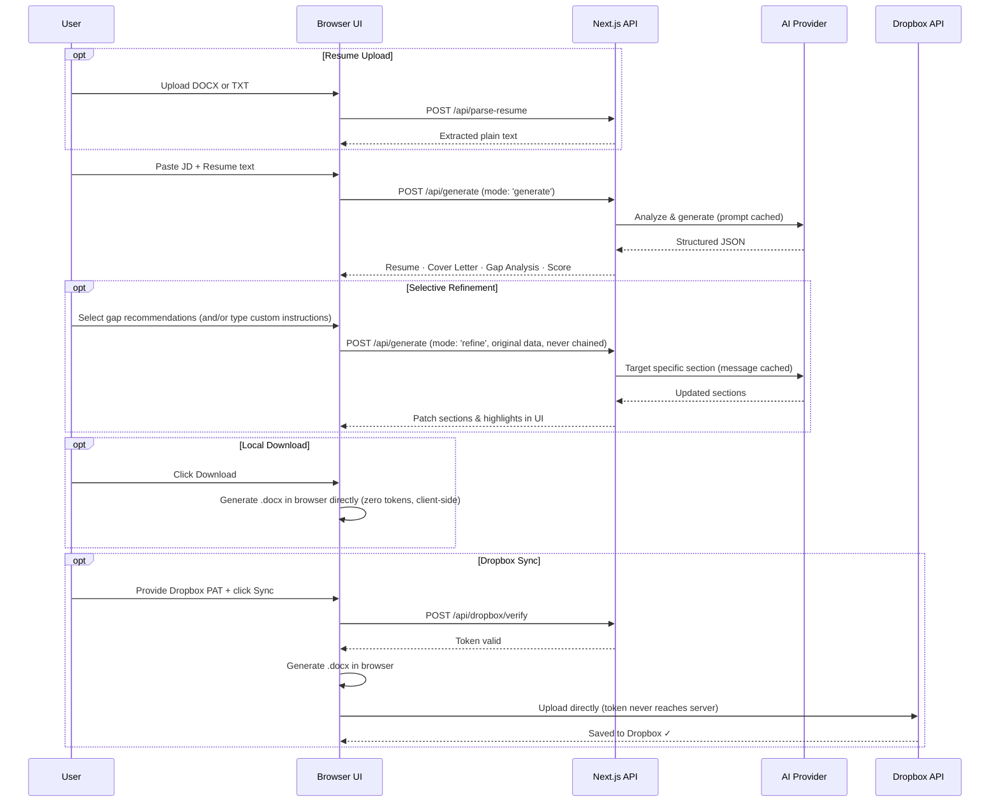
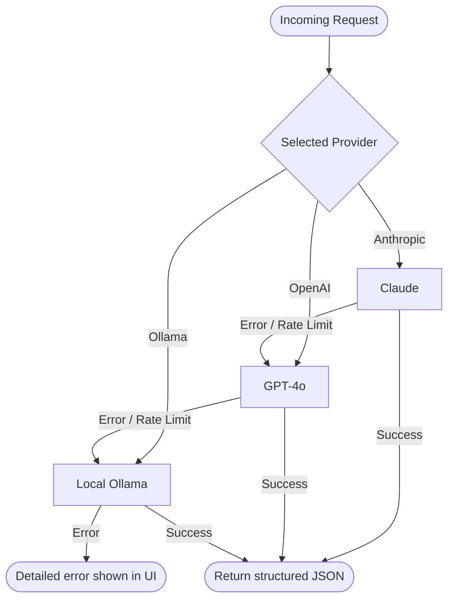
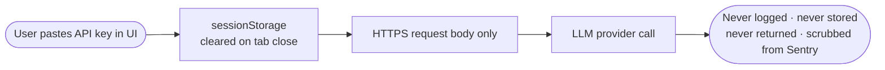

# Resume Builder v2.0 — AI-Powered ATS Resume Optimizer

Transform your resume to match any job description using Claude, GPT-4o, or a local Ollama model. One click generates a tailored resume, gap analysis, and cover letter — all downloadable as `.docx`.

**Live demo:** [resume-builder-phi-wine.vercel.app](https://resume-builder-phi-wine.vercel.app)

---

## What's New in v2.0

Version 2.0 introduces major architectural hardening, security enhancements, and cost-optimization strategies for production-grade resume tailoring.

- **Security Hardening**: Built-in SSRF protection for local LLMs, sliding-window rate limiting, and zero-data-liability `sessionStorage` management.
- **Cost & Latency Optimized**: Support for Anthropic's native Prompt Caching and OpenAI's automatic message caching to reduce API costs by up to 90% on repeated runs.
- **Multi-Provider Resilience**: Dynamic fallback chain (Anthropic → OpenAI → Ollama) with automatic provider locking and banner notifications.
- **Architectural Excellence**: Fully modular React hook architecture, Zod-validated API responses, and comprehensive CSP security headers.
- **Dropbox Cloud Sync**: Secure, browser-direct DOCX upload to Dropbox without sharing your token with our servers.

---

## Features

| Feature | Description |
|---------|-------------|
| **ATS-Optimized Resume** | 5-step methodology: JD analysis → keyword gap → section rewrites → formatting → summary |
| **Keyword Coverage Score** | 0–100% match with colour-coded indicator |
| **Gap Analysis** | Strong matches, implied gaps, dealbreakers, and actionable recommendations |
| **Missing Keywords Panel** | AI surfaces keywords you may have but didn't mention — you select which apply |
| **Selective Refine** | Apply only the recommendations you choose — always from the original, never chained |
| **Revert to Original** | Instantly restore the pre-refine state — zero tokens, zero API calls |
| **Original / Updated Toggle** | Side-by-side comparison of before/after in Resume and Cover Letter panels |
| **Cover Letter** | 3–4 paragraph letter tailored to the JD and company |
| **`.docx` Download** | ATS-clean Word files; respects the active Original/Updated view |
| **Multi-Provider LLM** | Anthropic → OpenAI → Ollama with auto-fallback and banner notification |
| **Cost & Latency Optimized** | Native prompt caching (Anthropic) and automatic message caching (OpenAI) |
| **Dropbox Sync** | Browser-direct upload — your Dropbox token never reaches the server |
| **Your key, your data** | API keys in `sessionStorage` only — never logged or persisted |
| **Rate Limiting** | 5 generates/min · 15 refines/min per IP with friendly countdown on `429` |

---

## Quick Start

```bash
# 1. Clone
git clone https://github.com/hardikshukla/resume-builder
cd resume-builder

# 2. Install
npm install

# 3. Configure
cp .env.example .env.local
# No API keys needed in .env.local — users paste their own in the UI

# 4. Run
npm run dev
# → http://localhost:3000
```

---

## Environment Variables

Copy `.env.example` → `.env.local`. All values are optional — sensible defaults are shown below.

| Variable | Default | Description |
|----------|---------|-------------|
| `DEFAULT_LLM_PROVIDER` | `anthropic` | Provider shown by default in the UI |
| `ANTHROPIC_MODEL` | `claude-haiku-4-5` | Claude model ID (user can override in UI) |
| `OPENAI_MODEL` | `gpt-4o` | OpenAI model ID (user can override in UI) |
| `OLLAMA_BASE_URL` | `http://localhost:11434` | Ollama server base URL |
| `OLLAMA_MODEL` | `llama3` | Ollama model name |
| `ALLOW_LOCALHOST_OLLAMA` | *(unset)* | Set to `1` to allow `localhost` as an Ollama URL (SSRF guard blocks it by default) |
| `NEXT_PUBLIC_SENTRY_DSN` | *(unset)* | Sentry DSN for browser error tracking |
| `SENTRY_DSN` | *(unset)* | Sentry DSN for server-side tracking (falls back to `NEXT_PUBLIC_SENTRY_DSN`) |
| `SENTRY_ORG` | *(unset)* | Sentry org slug — only needed for source-map upload in CI |
| `SENTRY_PROJECT` | *(unset)* | Sentry project name — only needed for source-map upload in CI |

> **API keys never go in `.env`.** Users paste their own key in the UI. Keys live in `sessionStorage`, travel only in HTTPS request bodies, and are never logged, stored, or returned by the server.

---

## API Routes

| Route | Method | Purpose |
|-------|--------|---------|
| `/api/generate` | `POST` | Processes full generation (`mode: 'generate'`) and refinement (`mode: 'refine'`) |
| `/api/parse-resume` | `POST` | Extracts plain text from an uploaded DOCX or TXT file |
| `/api/models` | `POST` | Lists available models for the selected provider (cached 60 s per user) |
| `/api/config` | `GET` | Retrieves default provider configurations (SSRF blocklists, etc.) |
| `/api/dropbox/verify` | `POST` | Validates the user's Dropbox personal access token |
| `/api/dropbox/sync` | `POST` | Uploads generated `.docx` files directly to the user's Dropbox |

### Rate Limits

| Route | Limit | Window |
|-------|-------|--------|
| `/api/generate` | 15 requests | 60 s per IP |
| `/api/dropbox/sync` | 5 requests | 60 s per IP |

Returns `429` with a `Retry-After` header and a `retryAfterSeconds` field in the JSON body.

---

## How It Works

### Generation & Refinement Flow



### LLM Fallback Chain



> A banner appears in the UI whenever a fallback provider was used.

---

## Project Structure

```
hooks/
  useApiKey.ts              API-key state + sessionStorage helpers
  useGenerate.ts            Resume generation hook (both full generate and refine)
  useInactivityTimeout.ts   Clears sessionStorage after 20 min of inactivity

app/
  page.tsx                  The single-page resume builder UI orchestrator (conflates components)
  globals.css               Design tokens and component styles (pure CSS, no Tailwind)
  layout.tsx                Root layout + SEO metadata
  api/
    config/route.ts         Retrieves provider configurations (e.g. default models)
    generate/route.ts       Handles full generation and refinement LLM dispatch
    models/route.ts         Retrieves available models for the selected provider
    parse-resume/route.ts   Extracts text from uploaded DOCX or TXT files
    dropbox/
      verify/route.ts       Validates Dropbox personal access tokens
      sync/route.ts         Uploads generated files directly to Dropbox

components/
  ThemeRegistry.tsx         Material-UI Theme and cache registry

lib/
  prompt.ts                 buildSystemPrompt(), buildUserMessage(), buildRefinePrompt()
  docxGenerator.ts          Surgical DOCX generator
  coverLetterGenerator.ts   Cover letter DOCX generator
  constants.ts              MAX_RESUME_CHARS, MAX_JD_CHARS, warn thresholds
  utils/
    string.ts               buildDownloadFilename, capitalizeName
  llm/
    index.ts                Fallback-chain router
    anthropic.ts            Claude handler (native prompt caching)
    openai.ts               GPT-4o handler
    ollama.ts               Ollama handler
    schema.ts               Zod schema for LLM output validation

middleware.ts               Rate limiting (sliding window per IP)
types/index.ts              All shared TypeScript types

__tests__/
  prompt.test.ts            buildSystemPrompt, buildRefinePrompt, GapAnalysis schema
  docx.test.ts              DOCX generators checks
  timeout.test.ts           Inactivity timeout checks
  filename.test.ts          Download filename checks
  sentry.test.ts            Sentry config checks
```

---

## Security



Additional hardening:

- **SSRF protection** — `/api/models` validates `ollamaUrl` against a blocklist of internal IP ranges
- **Rate limiting** — sliding-window per-IP counter in `middleware.ts`
- **Filename sanitization** — `Content-Disposition` strips path-traversal characters; uses RFC 5987 encoding
- **Security headers** — CSP, `X-Frame-Options: DENY`, HSTS, `Permissions-Policy`, `Referrer-Policy`

---

## Tests

```bash
npm test                 # Run all tests
npm run test:coverage    # With coverage report
```

| Suite | What it covers |
|-------|---------------|
| `prompt.test.ts` | `buildSystemPrompt` idempotency, placeholder rule, 5-step headings, `buildRefinePrompt` embedding, GapAnalysis schema shape |
| `docx.test.ts` | Generators return valid ZIP blobs (PK magic bytes), produce files >5 KB, produce distinct output for distinct inputs |

---

## Deploy to Vercel

```bash
npx vercel
```

Set these in **Vercel Dashboard → Project → Settings → Environment Variables**:

```
DEFAULT_LLM_PROVIDER=anthropic
ANTHROPIC_MODEL=claude-haiku-4-5
OPENAI_MODEL=gpt-4o
OLLAMA_BASE_URL=http://localhost:11434
OLLAMA_MODEL=llama3
NEXT_PUBLIC_SENTRY_DSN=https://...   # optional
SENTRY_DSN=https://...               # optional
SENTRY_ORG=your-org                  # optional — CI source maps only
SENTRY_PROJECT=resume-builder        # optional — CI source maps only
```

No API keys go into Vercel — users bring their own.

---

## Tech Stack

| Layer | Choice |
|-------|--------|
| Framework | Next.js 14 (App Router) |
| Language | TypeScript |
| Styling | Vanilla CSS (no Tailwind) |
| LLM — Primary | Anthropic Claude |
| LLM — Fallback 1 | OpenAI GPT-4o |
| LLM — Fallback 2 | Ollama (local) |
| DOCX generation | `docx` npm package |
| Error tracking | Sentry (optional) |
| Icons | Lucide React |
| Tests | Jest + ts-jest |
| Hosting | Vercel |
